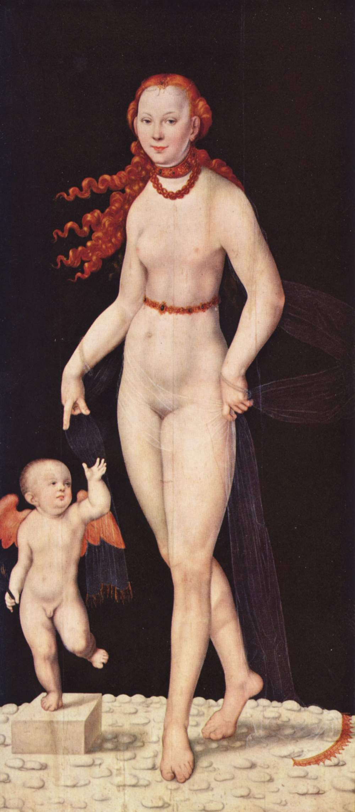

## Baroque AI - Programme Guide

2023-03-17 v1.0

A prototype publication of a fictional 'exhibition catalogue' based on a Wikidata based collection of seventeenth century painting from the Bavarian State Painting Collections. The prototype shows how with a compuational publishing pipeline different distributed linked open data (LOD) sources can be brough together in a multi-format computational publication — allowing for asynchronous collaborative working. Distributed LOD sources include: Wikidata/base, Nextcloud, Thoth, Semantic Kompakkt, TIB AV Portal, and more.

Prototype series: Baroque TOC

Coordinated by Simon Worthington - NFDI4Culture @Open Science Lab, TIB, Hannover

March-April 2023

Venus und Cupido, Heinrich Bollandt, between circa 1620 and circa 1630. https://commons.wikimedia.org/wiki/File:Heinrich_Bollandt_-_Venus_und_Cupido.jpg This work is in the public domain.

### Cite as 

Document DOI:  | Author: Simon Worthington https://orcid.org/0000-0002-8579-9717 

 This work is licensed under a <a rel="license" href="http://creativecommons.org/licenses/by-sa/4.0/">Creative Commons Attribution-ShareAlike 4.0 International License</a>.
